***CSE 15l week 1 Lab Report***

**Installing VScode**
- I already had VScode installed before the lab so I didn’t really have to do anything for this step
- To be able to install VScode you have to go to https://code.visualstudio.com/ and choose the version that matches your operating system to install
- When you have VScode installed and opened it should look like the screenshot below

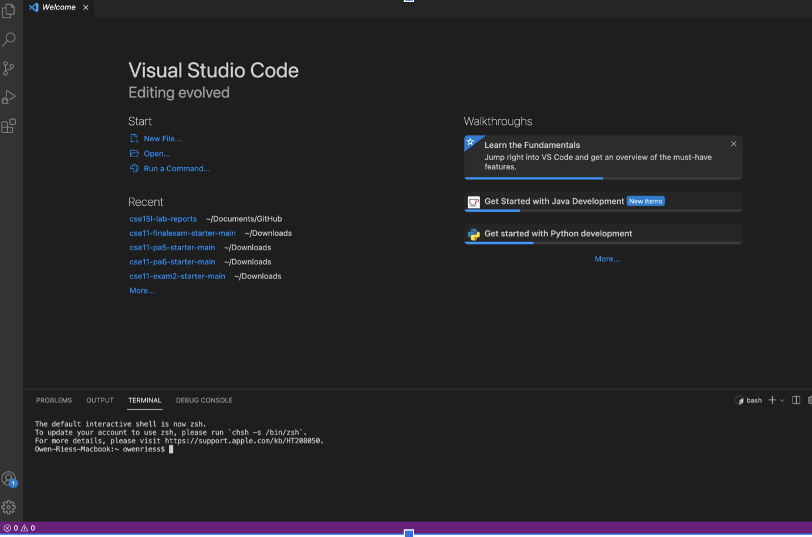


**Remotely Connecting**

- The first thing to verify is that your computer has OpenSSH installed. To verify on Mac you open the menu>System preferences>sharing>remote login. It should look like this

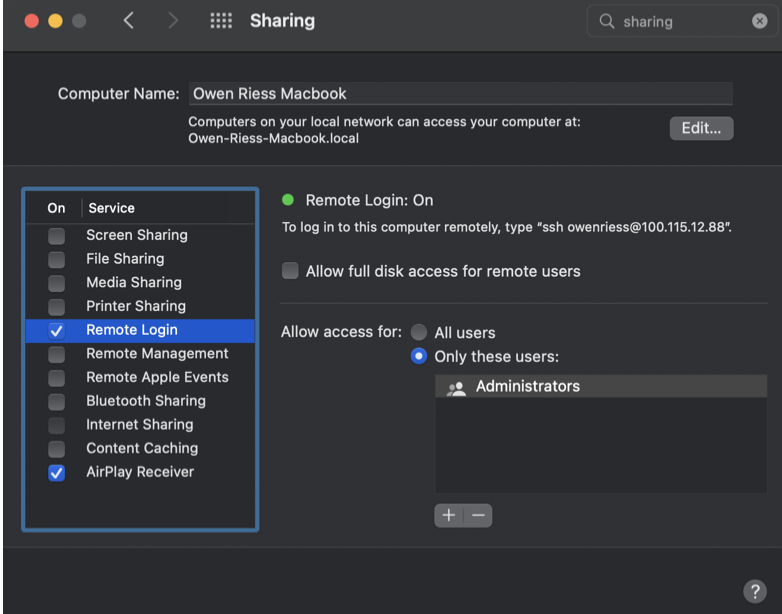

- After that step you will have to go https://sdacs.ucsd.edu/~icc/index.php to look up your account and change your password for your cse 15l account
- The next step is to open up the terminal on VScode by Terminal > New Terminal on the menu commands and put in ssh cse15lfa22zz@ieng6.ucsd.edu, but replace the with the last 2 letters in your cse 15l account username. Then click enter.
- Then you will type in the new password that you made and it should look like this.

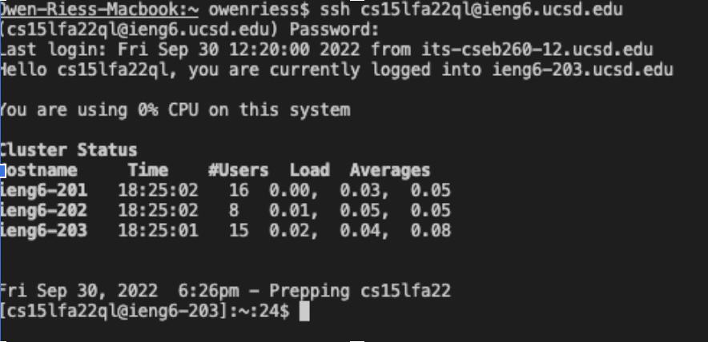

**Trying Some Commands**

- The first command is the cd command which is used to move between directories
- The ls -lat command is used to list of all the file on the current directory

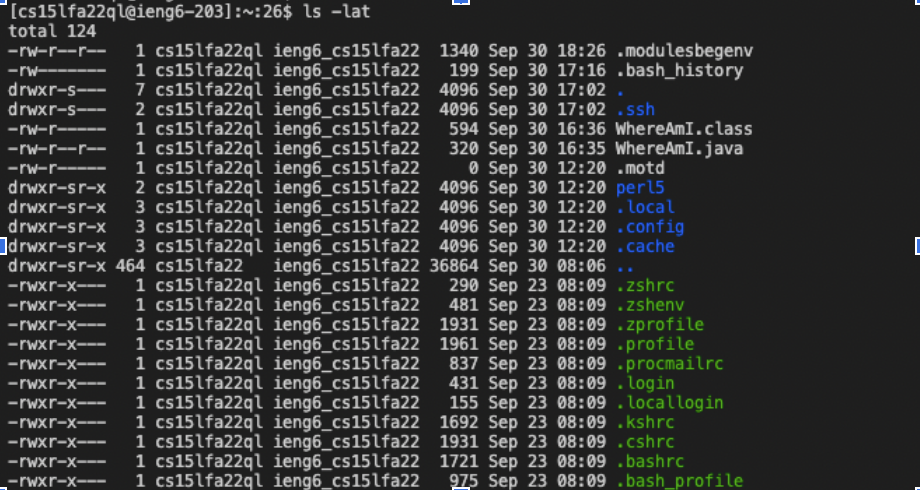

- The ls -a command lists what is in the current directory

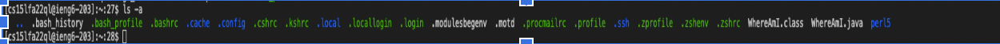

- The exit command is used to exit out of the remote desktop

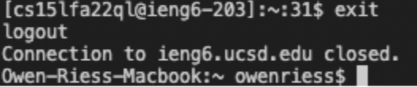

**Moving Files With scp**

- The first step is to compile and run the code that is in the file you created using the javac and java commands

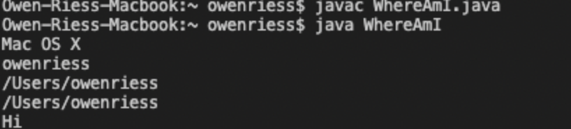

- Then in the terminal you will type out 
scp WhereAmI.java cs15lfa22ql@ieng6.ucsd.edu:~/ in this case WhereAmI.java is the file that I’m moving and ql are the last 2 letters from cse 15l account username. It will then ask for your password.

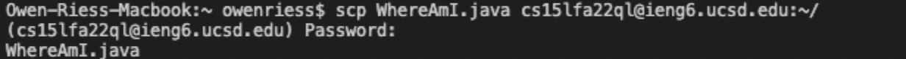

- After completing the previous step you will then ssh back into the remote desktop and you will then be able to compile and run the file you moved.

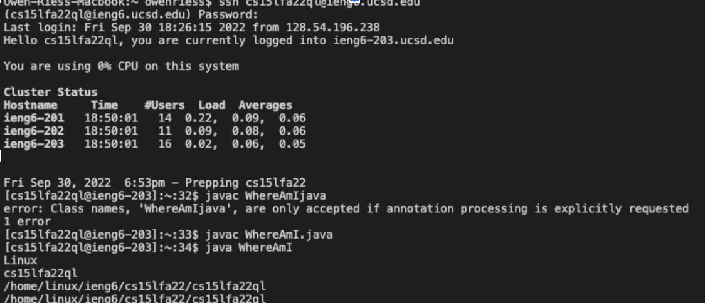

**Setting An SSH Key**

 - The first step is to run the ssh -keygen command on your computer then after that you will type out /Users/owenriess/.ssh/id_rsa owenriess is the user in this case then it will ask for you to make a passphrase

 

 - Then in the terminal you will sign back into the remote desktop cse15lfa22zz@ieng6.ucsd.edu and fill in your password. Once you are signed in you will run the mkdir .ssh command then exit after that.

 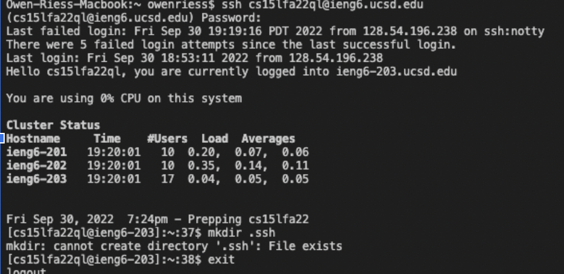

 - Once you are logged out you will then type out 
 scp /Users/owenriess/.ssh/id_rsa.pub cs15lfa2ql2@ieng6.ucsd.edu:~/.ssh/authorized_keys in the terminal and put in the password that you created.

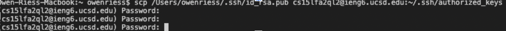

**Optimizing Remote Running**

- If you want to run a command while logging into the remote server you can write the command you want to do right after the ssh command for example 
ssh cs15lfa22ql@ieng6.ucsd.edu "ls" will list the home directory on the remote server right after logging in 

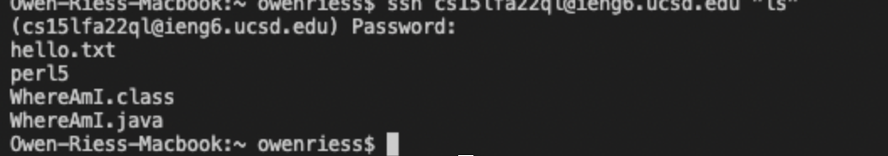

- You can use semicolons in order to run multiple commands on the same line in the terminal for example cp WhereAmI.java OtherMain.java; javac Othermain.java; java WhereAmI will compile and run WhereAmI and OtherMain


- A way to write out the commands that you want to type on terminal you can use the up arrow to go through previous commands that you have ran.


<div style="page-break-after: always"></div>


**Lab Report 2**

**Part 1**
```
class Handler implements URLHandler {
    
    ArrayList<String> words = new ArrayList<String>();
 
    public String handleRequest(URI url) {
        if (url.getPath().equals("/")) {
            return String.format("List of words: %s", words);
        } 
        if (url.getPath().contains("/add")) {
            String[] parameters = url.getQuery().split("=");
            if (parameters[0].equals("s")) {
                words.add(parameters[1]);
                return String.format("added %s!", parameters[1]);
            }
        }
        if (url.getPath().contains("/search")) {
            ArrayList<String> substring = new ArrayList<String>();
            String[] parameters = url.getQuery().split("=");
            if (parameters[0].equals("s")) {
                for (String word: words) {
                    if (word.contains(parameters[1])) {
                        if (!substring.contains(word)) {
                            substring.add(word);
                        }
                    }
                }
                return String.format("words that contain substring: %s", substring);
            }
        }
        return "404 Not Found!";
    }
}
```


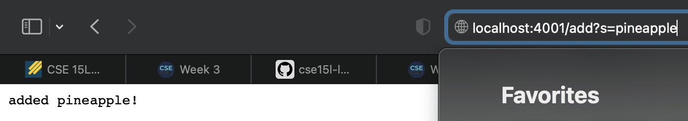

- Here I called s=pineapple in the query after the path   /add of the url which is supposed to add the string pineapple to my arraylist that I created and return "added pineapple!"

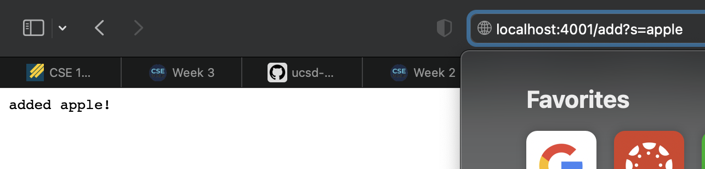

- In this image I called s=apple in the query after the path /add of the url which is supposed to add the string apple to my arraylist that I created and return "added apple!"

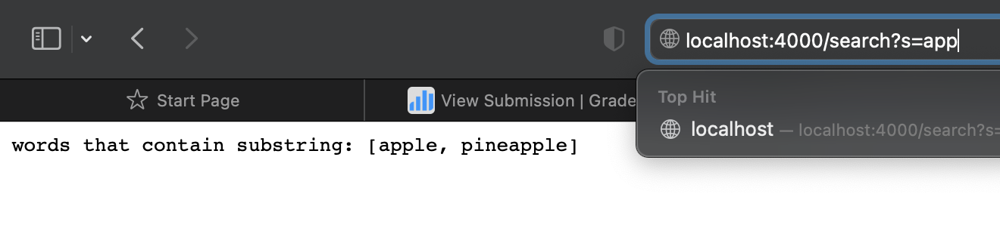

- This image shows what happens when I call s=app in the query after the path /search of the url which is supposed to return all the words that have been added that contain the substring app within them


**Part 2**

Given code
```
static void reverseInPlace(int[] arr) {
    for(int i = 0; i < arr.length; i += 1) {
      arr[i] = arr[arr.length - i - 1];
    }
  }
```

fixed code
```
static void reverseInPlace(int[] arr) {
    for(int i = 0; i < arr.length/2; i += 1) {
      int temp = arr[i];
      arr[i] = arr[arr.length-1-i];
      arr[arr.length-1-i] = temp;
    }
  }
```
- An example of a faliure inducing input of the orginal code could be [1,2,3,4] 

- The symptom of the given code was that it replacing the numbers one at a time in the array which meant that the numbers that got replaced in the first half were replacing the numbers in the second half of the array.

- The bug in the code that needed to be fixed was instead of iterating thruogh the whole array only going through half of the array and swaping the numbers in the front and back half around.

- The connection between the bug and the symptom was that the symptom which was not reversing the list of numbers properly was causing the test to reverse a list of numbers to not match the intended output.

 Given Code
```
static List<String> filter(List<String> list, StringChecker sc) {
    List<String> result = new ArrayList<>();
    for(String s: list) {
      if(sc.checkString(s)) {
        result.add(0, s);
      }
    }
    return result;
  }
  ```

fixed code

```
interface StringChecker { boolean checkString(String s); }

class MyStringChecker implements StringChecker {

  public MyStringChecker() {

  }
  public boolean checkString(String s) {
    if (s.equals("word")) {
      return true;
    }
    else {
      return false;
    }
  }

}
class ListExamples {
  static List<String> filter(List<String> list, StringChecker sc) {
    List<String> result = new ArrayList<>();
    for(String s: list) {
      if(sc.checkString(s)) {
        result.add(0, s);
      }
    }
    return result;
  }
```
  - The faliure inducing input was that when writing a test I wasn't able to pass through a StringChecker object.

  - The symptom was that the filter method was trying to pass through a StringChecker object without having anything that implemented the StringChecker interface.
   

  - To fix the bug I created a class that implemented StringChecker so I could pass through a valid StringChecker object when writing my test for this method.

  - the connection between the bug and the symptom in the code above is that the symptom which was a method trying to pass in a object that it couldn't was causing the bug which was the code not running properly and not being able to test the method.


<div style="page-break-after: always"></div>

**Lab Report 3**

```
Owen-Riess-Macbook:docsearch owenriess$ find . -type f -mmin -10
./technical/911report/chapter-1.txt
```
- Here the command *find . -type f -mmin -10* was used to find all the files that had been edited in the last 10 minutes. I edited the ./technical/911report/chapter-1.txt file a little so that is why it showed up when this command was called. This could be useful for monitoring what is being changed when you are collaborating with people on big projects. 

```
Owen-Riess-Macbook:docsearch owenriess$ find . -type f -mmin +1 -mmin -10
./technical/911report/chapter-1.txt
```
- The command *find . -type f -mmin +1 -mmin -10* is pretty similar to the one above but it is just looking for files that have been edited more then 1 minute ago and less then 10 minute ago. This can be helpful for checking what files were being edited at more specific times. 

```
Owen-Riess-Macbook:docsearch owenriess$ find . -type d -mtime -10
.
./lib
./.git
./.git/objects
./.git/objects/6f
./.git/objects/02
./.git/objects/a4
./.git/objects/bb
./.git/objects/ab
./.git/objects/c7
./.git/objects/c0
./.git/objects/fe
./.git/objects/ec
./.git/objects/18
./.git/objects/pack
./.git/objects/80
./.git/objects/10
./.git/objects/19
./.git/objects/info
./.git/objects/62
./.git/objects/08
./.git/objects/d5
./.git/objects/f9
./.git/objects/46
./.git/objects/12
./.git/objects/47
./.git/info
./.git/logs
./.git/logs/refs
./.git/logs/refs/heads
./.git/logs/refs/remotes
./.git/logs/refs/remotes/origin
./.git/logs/refs/remotes/upstream
./.git/hooks
./.git/refs
./.git/refs/heads
./.git/refs/tags
./.git/refs/remotes
./.git/refs/remotes/origin
./.git/refs/remotes/upstream
./.git/branches
./technical
./technical/government
./technical/government/About_LSC
./technical/government/Env_Prot_Agen
./technical/government/Alcohol_Problems
./technical/government/Gen_Account_Office
./technical/government/Post_Rate_Comm
./technical/government/Media
./technical/plos
./technical/biomed
./technical/911report
```
- The command *find . -type d -mtime -10* is checking for all the directories that have been edited less then ten days ago. This can be helpful for keeping track of what directories have been edited over a longer period of time. 

```
Owen-Riess-Macbook:docsearch owenriess$ find . -size +5M
./.git/objects/pack/pack-76c2be97747be8c169abcc0a0a6082bddbd7ec39.pack
```
- The command *find . -size +5M* is searching all the files and returning all the files that larger then 5 megabytes in this case. This can be useful for finding which files are taking up the bulk of the space. 

```
Owen-Riess-Macbook:docsearch owenriess$ find . -size +100k
./lib/junit-4.13.2.jar
./.git/objects/pack/pack-76c2be97747be8c169abcc0a0a6082bddbd7ec39.pack
./.git/index
./technical/government/About_LSC/commission_report.txt
./technical/government/About_LSC/State_Planning_Report.txt
./technical/government/Env_Prot_Agen/multi102902.txt
./technical/government/Env_Prot_Agen/ctm4-10.txt
./technical/government/Env_Prot_Agen/bill.txt
./technical/government/Env_Prot_Agen/tech_adden.txt
./technical/government/Gen_Account_Office/d0269g.txt
./technical/government/Gen_Account_Office/GovernmentAuditingStandards_yb2002ed.txt
./technical/government/Gen_Account_Office/Sept27-2002_d02966.txt
./technical/government/Gen_Account_Office/d01376g.txt
./technical/government/Gen_Account_Office/Statements_Feb28-1997_volume.txt
./technical/government/Gen_Account_Office/pe1019.txt
./technical/government/Gen_Account_Office/gg96118.txt
./technical/government/Gen_Account_Office/d01591sp.txt
./technical/government/Gen_Account_Office/im814.txt
./technical/government/Gen_Account_Office/ai9868.txt
./technical/government/Gen_Account_Office/May1998_ai98068.txt
./technical/government/Gen_Account_Office/d02701.txt
./technical/biomed/1471-2105-3-2.txt
./technical/911report/chapter-13.4.txt
./technical/911report/chapter-13.5.txt
./technical/911report/chapter-13.2.txt
./technical/911report/chapter-13.3.txt
./technical/911report/chapter-3.txt
./technical/911report/chapter-1.txt
./technical/911report/chapter-6.txt
./technical/911report/chapter-7.txt
./technical/911report/chapter-9.txt
./technical/911report/chapter-12.txt
```
- The command *find . -size +100k* is searching all the files in the current directory that are over 100 kilobytes. This can be useful if we are trying to organize the files by size or we just want to know how many files over a certain size that we have. 

```
Owen-Riess-Macbook:docsearch owenriess$ find . -size +1G
```
- The command *find . -size +1G* return nowthing because none of the files in our current directory were over 1 gigabyte in size. This could more useful when working with bigger files. 

```
Owen-Riess-Macbook:docsearch owenriess$ find . -type f -name "chapter-11.txt"
./technical/911report/chapter-11.txt
```
- The command *find . -type f -name "chapter-11.txt"* is just looking for the file within the current directory that matches the name within the quotes. This could be useful for accessing a file that you know the name of quickly. 

```
Owen-Riess-Macbook:docsearch owenriess$ find . -type f -name "chapter*"
./technical/911report/chapter-13.4.txt
./technical/911report/chapter-13.5.txt
./technical/911report/chapter-13.1.txt
./technical/911report/chapter-13.2.txt
./technical/911report/chapter-13.3.txt
./technical/911report/chapter-3.txt
./technical/911report/chapter-2.txt
./technical/911report/chapter-5.txt
./technical/911report/chapter-6.txt
./technical/911report/chapter-7.txt
./technical/911report/chapter-9.txt
./technical/911report/chapter-8.txt
./technical/911report/chapter-12.txt
./technical/911report/chapter-10.txt
./technical/911report/chapter-11.txt
```

- The command *find . -type f -name "chapter*"* searching all the files within the current directory and returning all the files that begin with chapter. This could be useful for finding all the files that may be grouped together in some way because they all start with the same name. 

```
Owen-Riess-Macbook:docsearch owenriess$ find . -type f -iname "chapter*"
./technical/911report/chapter-13.4.txt
./technical/911report/chapter-13.5.txt
./technical/911report/chapter-13.1.txt
./technical/911report/chapter-13.2.txt
./technical/911report/chapter-13.3.txt
./technical/911report/chapter-3.txt
./technical/911report/chapter-2.txt
./technical/911report/Chapter-1.txt
./technical/911report/chapter-5.txt
./technical/911report/chapter-6.txt
./technical/911report/chapter-7.txt
./technical/911report/chapter-9.txt
./technical/911report/chapter-8.txt
./technical/911report/chapter-12.txt
./technical/911report/chapter-10.txt
./technical/911report/chapter-11.txt
```
- The command *find . -type f -iname "chapter*"* does the same thing as the command above but the iname makes it case insersitive so if there was a file that started with a capital C in chapter it would be included. I changed the file name for chapter 1 so that it was capital and it was still included but not included above. This could be usedful when many people have been told to make a file that starts with the same name but some people choose to make the word start with a captial letter and others choose not to. 


<div style="page-break-after: always"></div>

**Lab Report 5**

grade.sh 
```
CPATH=".:lib/hamcrest-core-1.3.jar:lib/junit-4.13.2.jar"
FPATH=$(find student-submission/* -type f)
rm -rf student-submission
git clone $1 student-submission

cd student-submission

if [[ $? -eq 0 ]]
then 
    echo "Successfully cloned"
else 
    echo "Clone failed"
    exit 
fi

FFILE=$(basename $FPATH)

if [[ $FFILE == "ListExamples.java" ]]
then
    echo "File found"
else   
    echo "$FFILE is not the correct file"
    exit 
fi

javac -cp $CPATH *.java

if [[ $? -eq 0 ]]
then 
    echo "Compiled successfully"
else
    echo "Compile error"
    exit 
fi 

java -cp $CPATH org.junit.runner.JUnitCore TestListExamples 2> output.txt

if [[ $? -eq 0 ]]
then
    echo "Test passed"
    exit
else 
    echo "Test failed"
    exit 
fi
```

Student submission [Methods corrected](https://github.com/ucsd-cse15l-f22/list-methods-corrected.git)

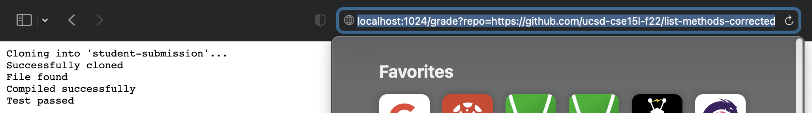

Student submission [Compile error](https://github.com/ucsd-cse15l-f22/list-methods-compile-error.git)

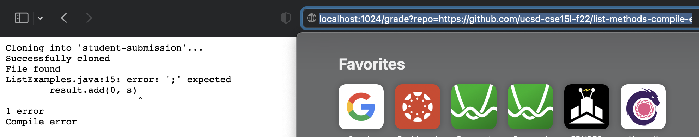

Student submission [Filename](https://github.com/ucsd-cse15l-f22/list-methods-filename.git)

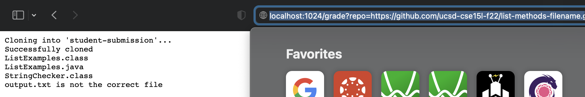


**Trace for Method corrected code